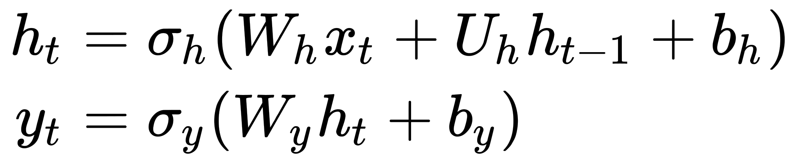
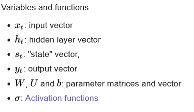
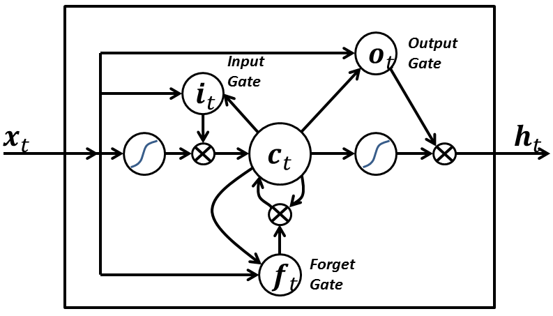
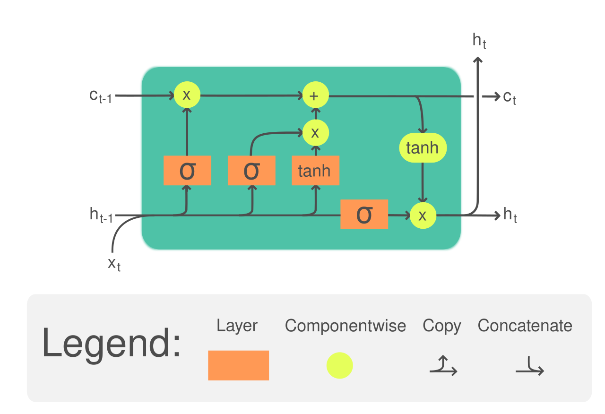
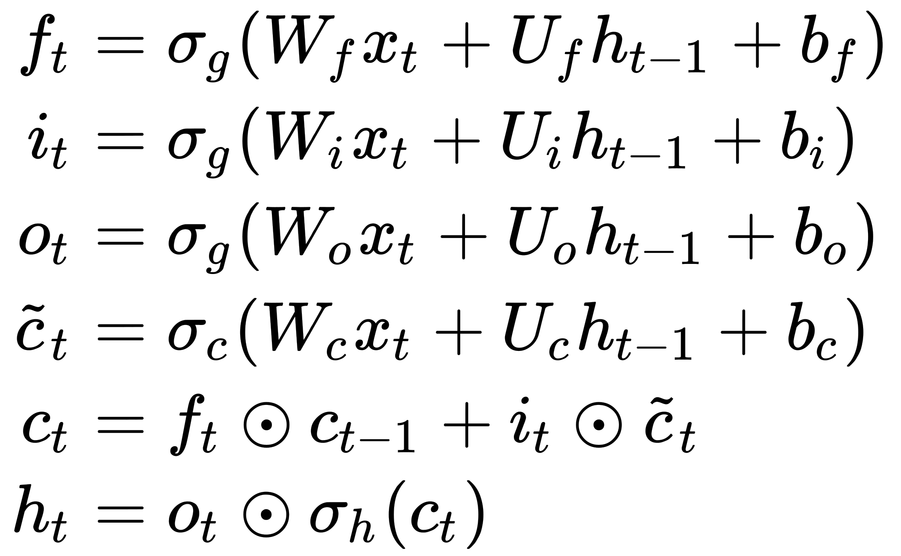
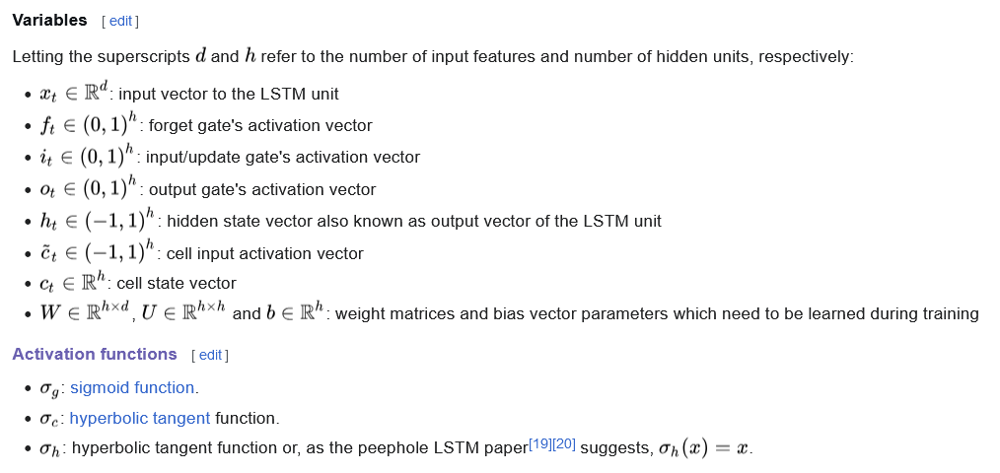

# RNN (Reccurent neural networks)
Recurrent neural networks (RNNs) are a class of artificial neural networks for sequential data processing. Unlike feedforward neural networks, which process data in a single pass, RNNs *process data across multiple time steps*, making them well-adapted for modelling and processing text, speech, and time series.

Grow block of RNN is *recurrent unit*. This unit maintains a *hidden state* wich we can represent as memmory about past state of input data. After processing input data in loop, network change state based on correlation between past time data and presents.
Basci RNN have porblem *vanishing gradient* where loss memmory about longtime input data, it solved by *LSTM*.

Using: in audo/speech processing/recognizing, time data processing (economics) atd.

Definition:

Legend:

### Input x Output relation
|Type relation|Application|
|-------------|-----------|
|*one to one*|image classification|
|*one to many*|image captioning|
|*many to one*|sentiment classification|
|*many to many*|machine translation|
|*many to many*|video classification|
### Activation function
Often use *tangh* for safe symetric by yaxis (plus negative value from x)

# LSTM (Long short-term memory)
LSTM is subtype of RNN. Their main feature is that they more *effectively find patterns and relationships* between individual points in a *time sequence separated by a large time step*.It has a high rate of recognition of non-segmented handwritten text, speech recognition, etc.

LSTM has the ability to remember time sequance on short and long distance. Key feature is LSTM *don't use activation function* in their reccurent components.

LSTM builded from cells and three components: input gate, output gate and forget gate. The cell remembers values over arbitrary time intervals and the three gates regulate the flow of information into and out of the cell. They use logic function with [0;1] value and make considfaretion about wich value will forgoted, going throw input/output gate.

### LSTM definition
Definition:

Legen:

# My questions:
Batch